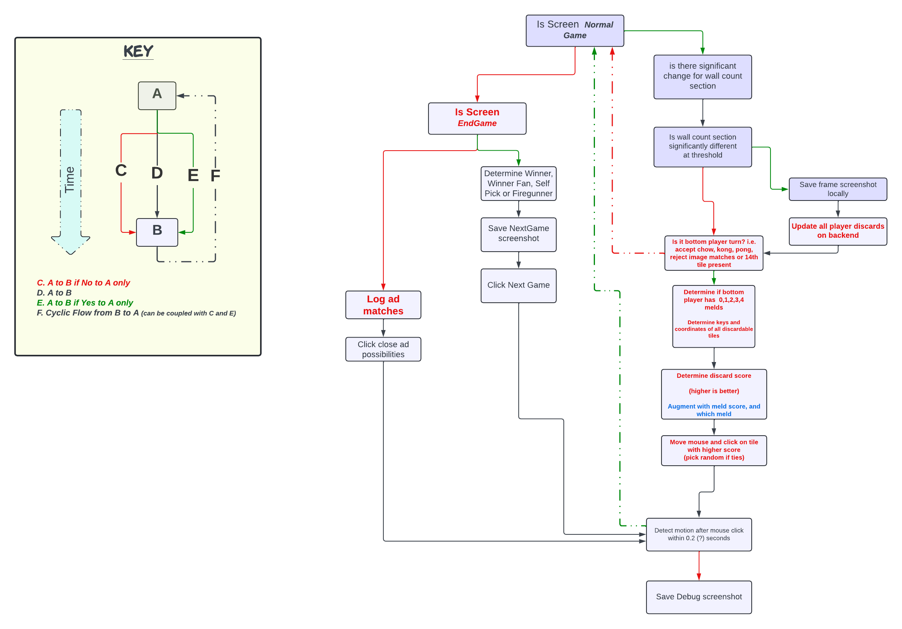

# DiscardWisdom - HK Mahjong 🀄 Discard Suggestor 
__Overview__: Ongoing pet project to create a tool/trainer to build intuition and enhance the gameplay experience of HK Mahjong players. This project integrates image recognition techniques and AI for strategic analysis to assist players in making optimal discard decisions, etc.

## 

🀀
🀁	
🀂	
🀃	
🀅	
🀆	
🀇	
🀈	
🀉	
🀊	
🀋	
🀌	
🀍	
🀎	
🀏	
🀐	
🀑	
🀒	
🀓	
🀔	
🀕	
🀖	
🀗	
🀘	
🀙	
🀚	
🀛	
🀜	
🀝	
🀞	
🀟	
🀠	
🀡	
🀢	
🀣	
🀤	
🀥	
🀦	
🀧	
🀨	
🀩	

- The associated [Google Colab notebook](https://github.com/eric-r-xu/DiscardWisdom/blob/main/DiscardWisdom.ipynb) utilizes game screenshots from the Hong Kong Mahjong Club mobile app ([iOS](https://apps.apple.com/us/app/hong-kong-mahjong-club/id488514298), [Android](https://play.google.com/store/apps/details?id=com.recax.mjclub&hl=en_US)) for tile image recognition. 
- It analyzes all discarded tiles and calculates a hand score after each discard. 
- The higher the hand score from each discarded tile, the less useful the algorithm predicts it is for maximizing your win and thus should be discarded from your hand.

## [HKMJ Validation Survey v1](https://forms.gle/p1MEc6aR4XaoHGoT8)

### Results 📊   
- For all 10 scenarios, 2+/3 participants suggested a tile in the top 50th percentile of recommended tiles to discard. 👍
- 1+ respondents correctly identified an optimal tile to discard in 8 out of 10 scenarios (exceptions: scenarios 9 and 10). 👍
- No specific feedback was given on any particular scenario. 🤐
### Conclusions and Next Steps 📝
- Scenarios 9 and 10 indicate potential scoring adjustments for chow vs pung possibilities, etc.
- Incorporating defensive strategies such as opponent discards is another valuable suggestion (thanks to you know who).
- The algorithm appears directionally correct, which is very encouraging ✅🏆
- Currently, I am working on generating empirical data with autoplay functionality to increase the likelihood of winning (增加胡) and decrease the likelihood of being the firegun (减少放铳).
- Any and all feedback is welcome. Feel free to message separately as well.

---
---

### Key Features/Notes

__Tile Image Recognition__: Utilizes game screenshots to accurately recognize and analyze tiles played and discarded

__Discard Analysis__: Strategically and comprehensively analyzes all discarded tiles during gameplay, calculating a hand score after each discard. The ML algorithm predicts the usefulness of each tile, strategically recommending discards that enhance offensive and defensive strategies.

__Platform__: Uses Jupyter and Google Colab notebooks for public execution and sharing.

__Automation with Autoplay Functionality__: Includes a script (mahjong/autoplay.py) that leverages image recognition and motion control to automate gameplay. This feature collects game screenshots and compiles game statistics to inform future enhancements.

#### Autoplay Decision Tree Flow Diagram

